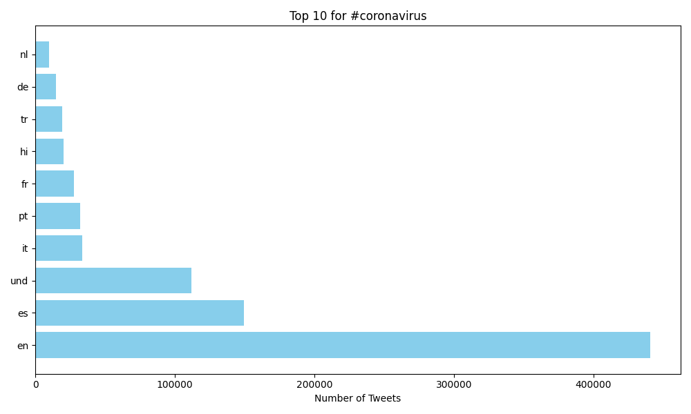
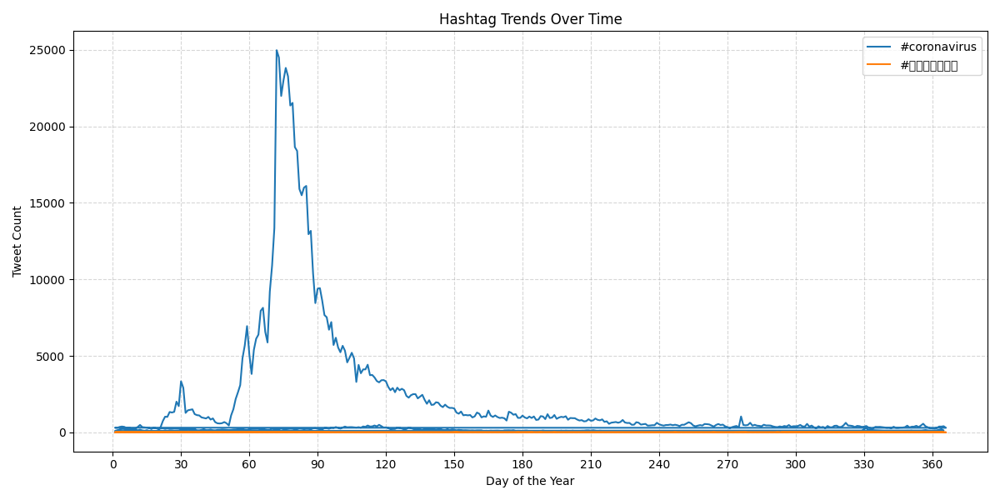

# Coronavirus Twitter Analysis

This project analyzes geotagged tweets from 2020 to track the spread and public conversation about the coronavirus on social media. Using MapReduce, we process massive datasets to extract meaningful insights about hashtag usage across different languages and countries.

## 💡 Learning Objectives
- Process large-scale datasets
- Work with multilingual text data
- Apply the MapReduce paradigm for parallel computation
- Visualize data trends using Python and Matplotlib

## 📊 Key Visualizations

1. **Top Languages Using #coronavirus**
   

2. **Top Countries Using #coronavirus**
   

3. **Top Languages Using #코로나바이러스**
   

4. **Hashtag Trends Over Time**
   

## ⚙️ How It Works

### MapReduce Workflow
1. **Map Step:** Extracts hashtag counts by language and country from the dataset.
2. **Reduce Step:** Aggregates counts across all datasets.
3. **Visualization:** Generates bar charts and line plots to showcase the results.

### Scripts
- `src/map.py`: Maps hashtags to languages and countries.
- `src/reduce.py`: Aggregates the mapped data.
- `src/visualize.py`: Creates bar plots for top hashtags.
- `src/alternative_reduce.py`: Plots hashtag trends over time.

## 🚀 Running the Project

1. **Run Mapping:**
   ```bash
   nohup ./run_maps.sh > run_maps.log 2>&1 &

